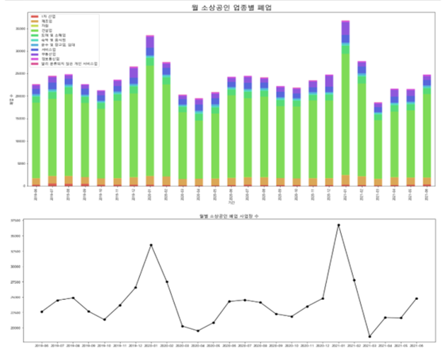
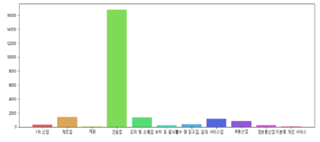
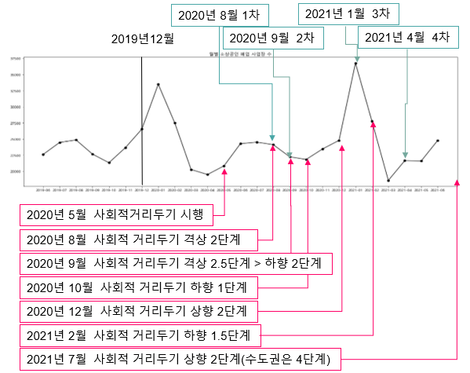
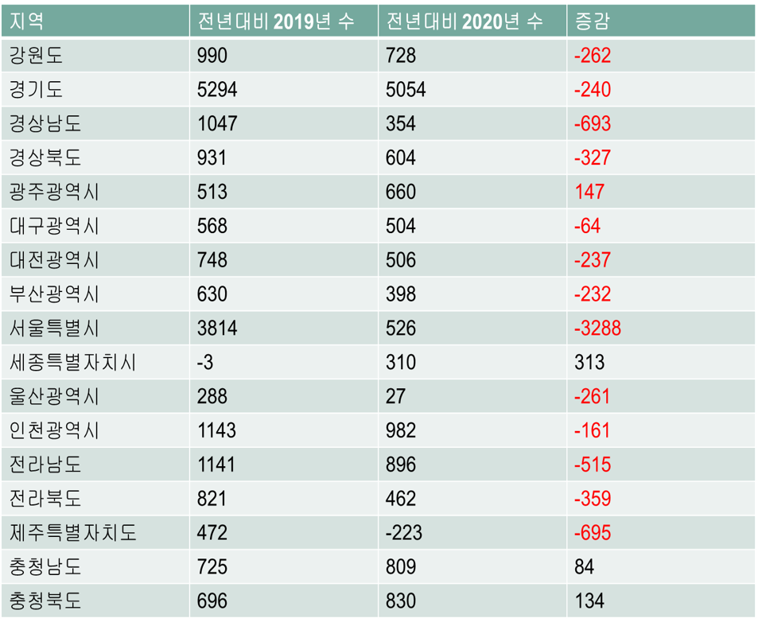
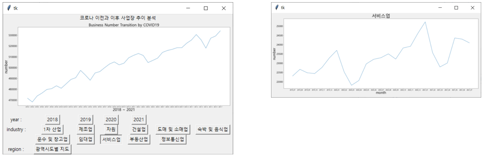
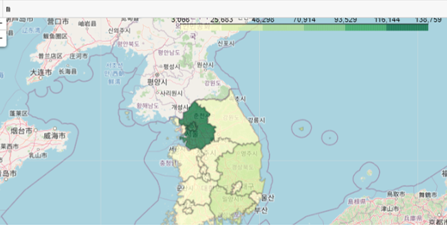
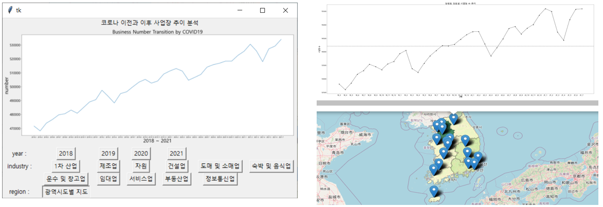

# Analysis Of Business Change Trend Data In Korea  

### 1. Contents  
    1) This program visualize business change trend in korea.  
    2) It can visualize business change trend by business type from 2019 to 2020 with graph.  
    3) It can visualize business change trend by region from 2019 to 2020 with graph and map.  
    4) Analyzation  
       A. Business type transition  
        - The construction industry closed the most and fluctuated the most.  
        - In both January 2019 and January 2020, the closure rate increased from January.  
  
  

        - There is a trend of fluctuations in disaster aid.  
  

       B. Regional transition  
        - Generally, workplace decreased in Korea between 2019 and 2020, standard from COVID-19.  
        - Regionally, workplace decreased between 2019 and 2020, standard from COVID-19 except '세종 자치시', '충청남도', '충청북도'.  
  

### 2.Setting  
    1) Prepare data from "공공데이터 포탈" (https://www.data.go.kr/data/15083277/fileData.do).  
    2) Install Numpy, Pandas, Tkinter, Matplotlib, Webbrowser, Pillow library.  

### 3. data_processing Process  
    1) process data from "국민연금공단_국민연금 가입 사업장 내역".  
    2) Extract information number of workplace, regional, year and save xlsx file.  
    3) Make transition graph from data.  

### 4. ui Process
    1) Make user interface program.  
    2) Link to map information by Choropleth.  

### 5. business_type_handling Process  
    1) Data processing and visualization with classifyed business type data.
  
### 6. folium_visualization Process  
    1) Visualize with folium Map and show regional graph.  

### 7. regional_handling Process  
    1) extract and classify by region from whole data.  

### 8. small_business_visualization Process
    1) special analayzation about small business transition.  

### 9. Language  
    1) Python   
   
### 10. Result  
    1) UI Program and graph classfied by business type.  
  

    2) Folium map and visual improvement Korea map.  
  

    3) Business transition by regional data and connection with UI program.  
  